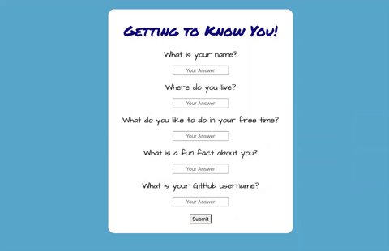

## Project #1 for Web Development Bootcamp

## Class Roster Generator

```
This program allows a user to answer a list of questions and when submitted, complete a google form. 

That form data is then populated into a Google Spreadsheet and then displayed to the end-user as a Bootstrap card element. 

```

* Here is a sample of the page on load and the animation that plays:

<p align="center">
  
</p>

* Here is a sample of the page once the google sheet API populates the card elements:

<p align="center">
  
</p>


## User Story

```
AS AN instructor of a coding bootcamp
I WANT to have students submit a form with their name, GitHub username, fun facts
SO THAT I can efficiently learn the names of the students in my class

```


## Acceptance Criteria

```
GIVEN I am a student filling out the form
WHEN I fill out the form and click the “submit” button
THEN  a card will be generated containing the answers I submitted along with my GitHub profile picture
WHEN all students submit their forms, the instructor would be able to see a card roster of the students

```
#
